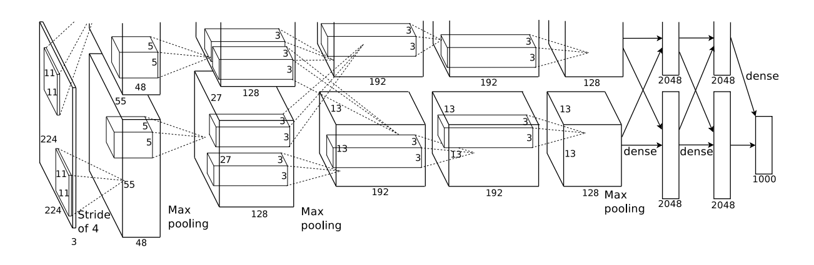
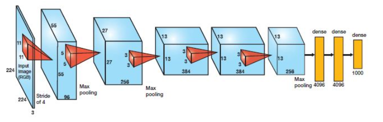
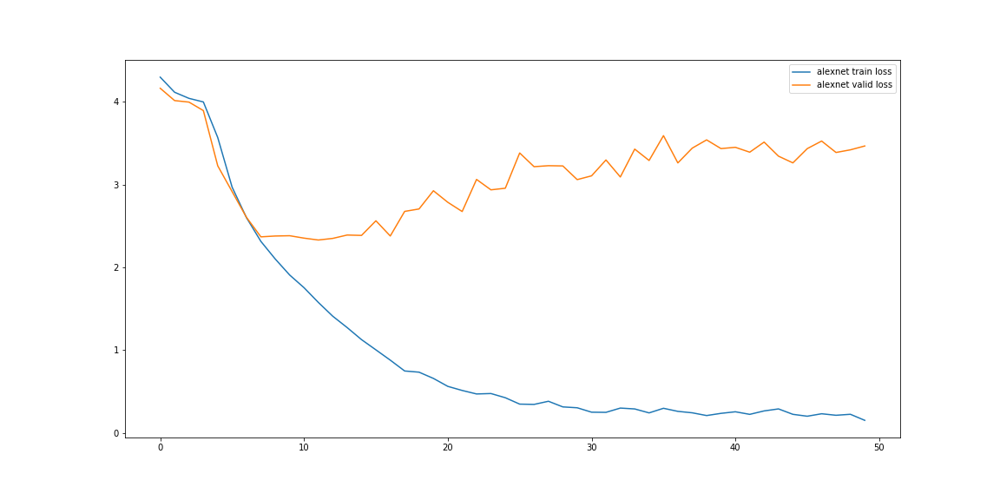
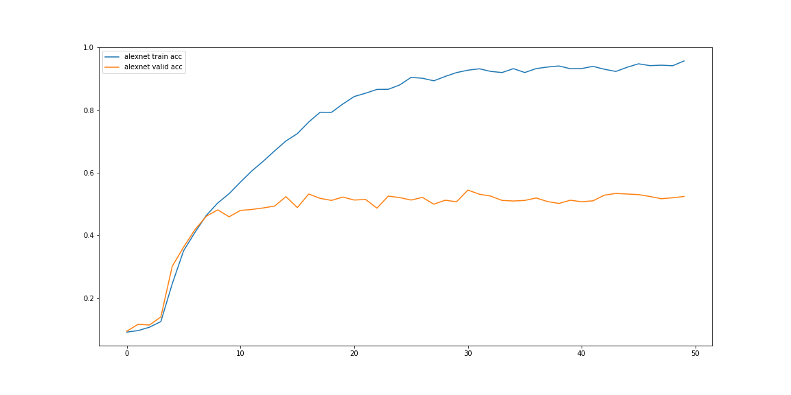

# AlexNet


## 简介
总的来说，目前处在深度学习第三次高潮时期，一般认为这个时期的开端是Hinton于2006年在Science上发表文章：一种称为“深度置信网络（deep belief network）”的神经网络模型可以通过逐层预训练的方式，有效完成模型训练过程。这就是“深度学习”这一名词的来由。

不过，这篇文章的发表远没有今天形容的这么伟大，甚至，在当时的学术界，并没有引起太大的波澜。真正让深度学习以及深度神经网络从“象牙塔中的研究”走到实际工业应用领域的是卷积神经网络在2012年计算机视觉的“圣杯”ImageNet竞赛上强势夺冠，超越第二名10.9个百分点。这场比赛让卷积神经网络乃至深度神经网络真正走到了世界学术的舞台上。

本项目使用Keras复现AlexNet并在数据集上进行效果测试。

- 论文标题

	ImageNet Classification with Deep Convolutional Neural Networks
- 论文地址
	
	https://papers.nips.cc/paper/4824-imagenet-classification-with-deep-convolutional-neural-networks.pdf
- 论文源码

	https://github.com/pytorch/vision/blob/master/torchvision/models/alexnet.py（PyTorch实现）


## 网络说明

### 结构说明



该结构分为上下两个部分，每部分含有五层卷积层和三层全连接层，之所以分为两部分是为了方便在两片GPU上进行训练，只在第三层卷积层和全连接层处上下两部分可以交互。由于上下两部分完全一致，分析时一般取一部分即可。



在该图中，大体的网络配置已经非常清晰，激活函数全部使用了Relu函数并使用了LRN进行参数规范化。

### 主要贡献

尽管这个结构在今天看来非常基础，但正是这样的结构为后面诸多复杂卷积神经网络提供了基础，在卷积神经网络的发展进程中占据里程碑式的地位。其主要的几个贡献如下。
- 首次将卷积神经网络应用于计算机视觉领域的海量图像数据集ImageNet（共1000类图像，总数约128多万张），揭示了卷积神经网络的强大学习能力和表示能力。当然，海量的数据也使得卷积神经网络免于过拟合。自此，卷积神经网络在计算机视觉领域开始了“井喷”式的研究。
- 利用GPU实现网络训练，大大加快了神经网络的训练速度。
- 使用了一些训练技巧，这些技巧使网络的训练由不可能变成了可能。如使用Relu激活函数、**局部响应规范化操作（LRN）**、为防止过拟合而采用的数据增广（data augmentation）和随机丢失（dropout）等。


## 代码实现

最新版本的Keras等框架已经不再提供LRN了，后面VGGNet等证明LRN并没有想象中那么好的效果，现在流行的规范化选择是BN，所以实现时使用BN层进行规范化。

由于AlexNet的局限性（参数不少、效果不比后来的很多卷积神经网络），现今的主流框架很多已经不再封装AlexNet了。下面主要实现AlexNet基本结构，去除LRN规范化。

```python
def AlexNet(input_shape=(224, 224, 3), n_classes=1000):
	"""

	:param input_shape:
	:param n_classes:
	:return:
	"""
	# input
	input_tensor = Input(shape=input_shape)
	# conv1
	x = Conv2D(96, (11, 11), strides=(4, 4), padding='valid', activation='relu')(input_tensor)
	# x = BatchNormalization()(x)
	x = MaxPooling2D((3, 3), strides=(2, 2), padding='valid')(x)
	# conv2
	x = Conv2D(256, (5, 5), strides=1, padding='same', activation='relu')(x)
	# x = BatchNormalization()(x)
	x = MaxPooling2D((3, 3), strides=(2, 2), padding='valid')(x)
	# conv3
	x = Conv2D(384, (3, 3), strides=1, padding='same', activation='relu')(x)
	x = Conv2D(384, (3, 3), strides=1, padding='same', activation='relu')(x)
	x = Conv2D(256, (3, 3), strides=1, padding='same', activation='relu')(x)
	x = MaxPooling2D((3, 3), strides=(2, 2), padding='valid')(x)
	# fc
	x = Flatten()(x)
	x = Dense(4096, activation='relu')(x)
	x = Dropout(0.5)(x)
	x = Dense(4096, activation='relu')(x)
	x = Dropout(0.5)(x)
	x = Dense(n_classes, activation='softmax')(x)
	model = Model(input_tensor, x)
	return model
```

**模型训练**

数据集使用[Caltech101数据集](http://www.vision.caltech.edu/Image_Datasets/Caltech101/)，比较性能，不进行数据增广（注意删除干扰项）。Batch大小定为32。损失函数使用经典分类的交叉熵损失函数，优化函数使用Adam，激活函数使用Relu。（这都是比较流行的选择）

**训练结果**

具体训练结果见文末Github的notebook文件。



可以看到，由于数据集小的限制，模型很快就陷入了过拟合。


## 补充说明
尽管今天看来，AlexNet已经不太实用，但是当时的很多思路影响了后来很多卷积神经网络的设计思路，如使用Relu作为激活函数、输出标准化。使用dropout防止过拟合。