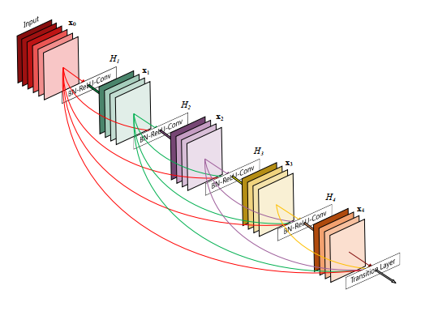
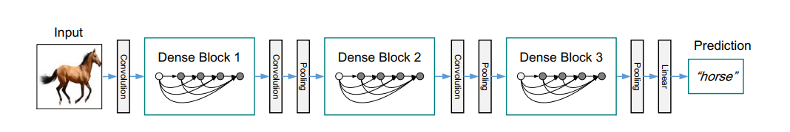
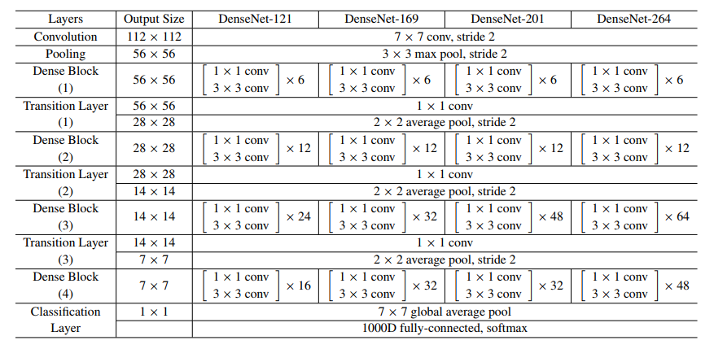
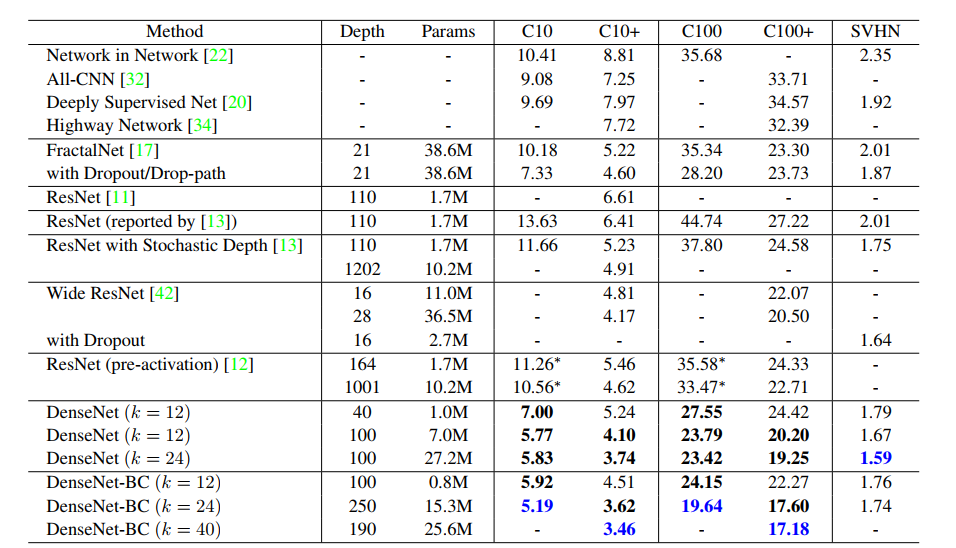
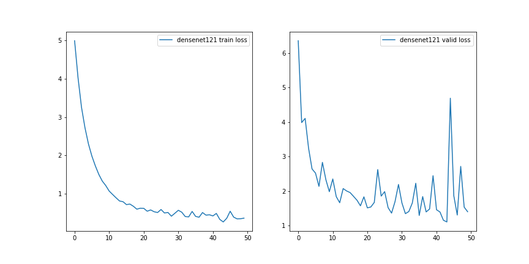
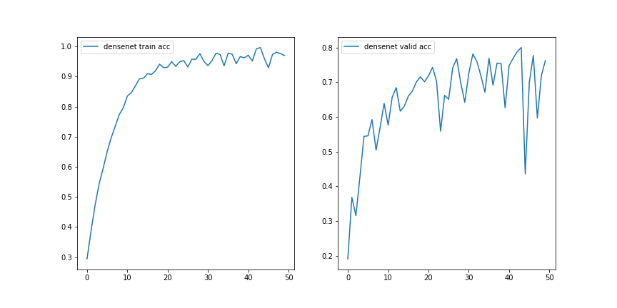

# DenseNet


## 简介
从2012年AlexNet大展身手以来，卷积神经网络经历了（LeNet、）AlexNet、ZFNet、VGGNet、GoogLeNet（借鉴Network in Network）、ResNet、DenseNet的大致发展路线。其实，自从ResNet提出之后，ResNet的变种网络层出不穷，各有特点，性能都略有提高。

在这种情况下，DenseNet可以说是“继往开来”也不为过，作为2017年CVPR最佳论文（认真研读这篇论文，绝对会感觉心潮澎湃），DenseNet思想上部分借鉴了“前辈”ResNet，但是采用的确实完全不同的结构，结构上并不复杂却十分有效，在CIFAR数据集上全面超越了ResNet。

本项目着重实现使用Keras搭建DenseNet的网络结构，同时，利用其在数据集上进行效果评测。

- 论文标题
	
	Densely Connected Convolutional Networks
- 论文地址

	https://arxiv.org/abs/1608.06993
- 论文源码

	https://github.com/pytorch/vision/blob/master/torchvision/models/densenet.py

## 网络说明

### 设计背景
以往的卷积神经网络提高效果的方法，要么更深（如ResNet，解决了深层网络出现的梯度消失问题），要么更宽（如GoogLeNet的Inception结构），而DenseNet的作者**从feature着手，通过对feature的极致利用来达到更好的效果同时减少参数**。

为了解决梯度消失（vanishing-gradient）问题，很多论文及结构被提出如ResNet、Highway Networks、Stochastic depth等，尽管网络结构有所差异，但是都不难改变一个核心思路**从靠前的层到靠后的层之间创建直通路线**如之前提到的[ResNet中的shortcut](https://blog.csdn.net/zhouchen1998/article/details/94651438)。DenseNet的作者延续这个思路，提出在保证网络中层与层之间最大程度的信息传输的前提下，直接将所有层连接起来。

### 结构设计
**dense block**

为了实现上述的所有层的信息传递，提出下面这张dense block结构。在之前的卷积神经网络中，如果有L层就会有L个连接，但是在DenseNet中，L层会有$L \times (L+1) \div 2$个连接，这种连接方式称为全连接。在下图中，$x_0$是输入的feature map，层$H_1$的输入就是$x_0$,层$H_2$的输入则是$x_0$和$x_1$。



DenseNet的网络很窄参数很少，这很大程度上得益于dense block的设计，在dense block中每个卷积层输出的feature map数量很少（基本上小于100）。同时这种连接方式使得特征和梯度的传递更加有效，网络更加容易训练，主要是因为梯度消失的主要原因就是输入信息以及梯度信息在很多层之间传递导致的（这和前馈运算以及反馈运算的计算机制有关），采用dense block连接则相当于每一层和input及loss直接相连，减轻梯度消失的发生。

同时，这种dense connection有正则化的效果，对于过拟合有一定的抑制作用。

### 网络结构
流程示意



结构说明

有趣的是，这篇论文全文只出现了两个公式却让人明明白白理解的论文的核心要义（比起很多大段都是公式罗列的灌水文章确实好太多了）。

$$\mathbf{x}_{\ell}=H_{\ell}\left(\mathbf{x}_{\ell-1}\right)+\mathbf{x}_{\ell-1}$$ 

上式借鉴ResNet思路，第l层的输出是l-1层的输出加上对l-1层输出的非线性变换（激活）。

$$\mathbf{x}_{\ell}=H_{\ell}\left(\left[\mathbf{x}_{0}, \mathbf{x}_{1}, \ldots, \mathbf{x}_{\ell-1}\right]\right)$$

上式由DenseNet提出，对0到l-1层的输出做concatenation（通道合并，类似Inception），H表示BN、Relu和3\*3卷积。

作者将整个DenseNet理解为多个dense block以及其他层的组合，这样可以确保每个dense block的size统一方便concate。
 
 

可以看到，作者主要提出了四种网络架构分别是DenseNet121、DenseNet169、DenseNet201以及DenseNet264，其中k表示growth rate，表示每个dense block每层输出的feature map个数，为了避免过宽的网络，设计均使用较小的k如32（事实证明，小的k具有更好的效果）。而且，由于后面的各层均可以得到前面各层的输出，所以最后concat得到的feature map通道数不小。

同时，每个dense block的3\*3卷积前都加了一个1\*1卷积，即为bottleneck layer，以求减少feature map数量，降维的同时融合了各通道的特征。此外，为了进一步压缩参数量，每两个dense block之间增加了1\*1卷积操作，它和池化层配合构成了Transition layer，经过该层默认channel减半。DenseNet-C表示增加了Transition layer，DenseNet-BC则表示既有bottleneck又有Transition layer。**bottleneck主要是为了减少通道数进行降维，减少计算量；Transition layer主要目的也是对feature map进行降维，减少通道数。**

### 网络效果

  
DenseNet-BC的网络参数和相同深度的DenseNet相比确实减少了很多，参数减少可以节省内存，减少过拟合现象的发生。总的来说，有力冲击ResNet的地位。

### 网络优点
- 减轻了梯度消失（vanishing-gradient）
- 大大加强了feature的传递
- 更加深入利用了feature
- 一定程度上减少了参数数量


## 代码实现
由于DenseNet最基础的DenseNet121都高达121层且代码封装度很高，对该模型进行了高度封装。

实际使用各个深度学习框架已经封装了DenseNet的几种主要网络结构（DenseNet121等），使用很方便，不建议自己搭建（尤其对于DenseNet这样很深的网络）。

网络构建对照结构表即可，这是复现论文网络结构的主要依据。默认参数实现的是带bottleneck的DenseNet121，其他结构调整函数的参数即可，参考[代码](https://github.com/titu1994/DenseNet/blob/master/densenet.py)。

```python
from keras.models import Model
from keras.layers import BatchNormalization, Conv2D, Activation, Dropout, AveragePooling2D, concatenate, GlobalAveragePooling2D, MaxPooling2D, Dense, Input
from keras.regularizers import l2
import keras.backend as K


def Conv_Block(input_tensor, filters, bottleneck=False, dropout_rate=None, weight_decay=1e-4):
    """
    封装卷积层
    :param input_tensor: 输入张量
    :param filters: 卷积核数目
    :param bottleneck: 是否使用bottleneck
    :param dropout_rate: dropout比率
    :param weight_decay: 权重衰减率
    :return:
    """
    concat_axis = 1 if K.image_data_format() == 'channel_first' else -1  # 确定格式

    x = BatchNormalization(axis=concat_axis, epsilon=1.1e-5)(input_tensor)
    x = Activation('relu')(x)

    if bottleneck:
        # 使用bottleneck进行降维
        inter_channel = filters * 4
        x = Conv2D(inter_channel, (1, 1),
                  kernel_initializer='he_normal',
                  padding='same', use_bias=False,
                  kernel_regularizer=l2(weight_decay))(x)
        x = BatchNormalization(axis=concat_axis, epsilon=1.1e-5)(x)
        x = Activation('relu')(x)

    x = Conv2D(filters, (3, 3), kernel_initializer='he_normal', padding='same', use_bias=False)(x)

    if dropout_rate:
        x = Dropout(dropout_rate)(x)
    return x


def Transition_Block(input_tensor, filters, compression_rate, weight_decay=1e-4):
    """
    封装Translation layer
    :param input_tensor: 输入张量
    :param filters: 卷积核数目
    :param compression_rate: 压缩率
    :param weight_decay: 权重衰减率
    :return:
    """
    concat_axis = 1 if K.image_data_format() == 'channel_first' else -1  # 确定格式

    x = BatchNormalization(axis=concat_axis, epsilon=1.1e-5)(input_tensor)
    x = Activation('relu')(x)
    x = Conv2D(int(filters * compression_rate), (1, 1),
              kernel_initializer='he_normal',
              padding='same',
              use_bias=False,
              kernel_regularizer=l2(weight_decay))(x)
    x = AveragePooling2D((2, 2), strides=(2, 2))(x)
    return x


def Dense_Block(x, nb_layers, filters, growth_rate, bottleneck=False, dropout_rate=None, weight_decay=1e-4, grow_nb_filters=True, return_concat_list=False):
    """
    实现核心的dense block
    :param x: 张量
    :param nb_layers: 模型添加的conv_block数目
    :param filters: 卷积核数目
    :param growth_rate: growth rate
    :param bottleneck: 是否加入bottleneck
    :param dropout_rate: dropout比率
    :param weight_decay: 权重衰减
    :param grow_nb_filters: 是否允许核数目增长
    :param return_concat_list: 是否返回feature map 的list
    :return:
    """
    concat_axis = 1 if K.image_data_format() == 'channels_first' else -1
    x_list = [x]

    for i in range(nb_layers):
        cb = Conv_Block(x, growth_rate, bottleneck, dropout_rate, weight_decay)
        x_list.append(cb)
        x = concatenate([x, cb], axis=concat_axis)

        if grow_nb_filters:
            filters += growth_rate

    if return_concat_list:
        return x, filters, x_list
    else:
        return x, filters


def DenseNet(n_classes=1000, input_shape=(224, 224, 3), include_top=True, nb_dense_block=4, growth_rate=32, nb_filter=64,
            nb_layers_per_block=[6, 12, 24, 16], bottleneck=True, reduction=0.5, dropout_rate=0.0, weight_decay=1e-4,
            subsample_initial_block=True):
    concat_axis = 1 if K.image_data_format() == 'channel_first' else -1

    final_nb_layer = nb_layers_per_block[-1]
    nb_layers = nb_layers_per_block[:-1]

    compression = 1.0 - reduction
    if subsample_initial_block:
        initial_kernel = (7, 7)
        initial_strides = (2, 2)
    else:
        initial_kernel = (3, 3)
        initial_strides = (1, 1)
    input_tensor = Input(shape=input_shape)
    x = Conv2D(nb_filter, initial_kernel, kernel_initializer='he_normal', padding='same',
              strides=initial_strides, use_bias=False, kernel_regularizer=l2(weight_decay))(input_tensor)
    if subsample_initial_block:
        x = BatchNormalization(axis=concat_axis, epsilon=1.1e-5)(x)
        x = Activation('relu')(x)
        x = MaxPooling2D((3, 3), strides=(2, 2), padding='same')(x)

    for block_index in range(nb_dense_block - 1):
        x, nb_filter = Dense_Block(x, nb_layers[block_index], nb_filter, growth_rate, bottleneck=bottleneck,
                                  dropout_rate=dropout_rate, weight_decay=weight_decay)
        x = Transition_Block(x, nb_filter, compression_rate=compression, weight_decay=weight_decay)
        nb_filter = int(nb_filter * compression)

    x, nb_filter = Dense_Block(x, final_nb_layer, nb_filter, growth_rate, bottleneck=bottleneck,
                              dropout_rate=dropout_rate, weight_decay=weight_decay)

    x = BatchNormalization(axis=concat_axis, epsilon=1.1e-5)(x)
    x = Activation('relu')(x)
    x = GlobalAveragePooling2D()(x)

    if include_top:
        x = Dense(n_classes, activation='softmax')(x)

    model = Model(input_tensor, x, name='densenet121')

    return model
```

**模型训练**

数据集使用[Caltech101数据集](http://www.vision.caltech.edu/Image_Datasets/Caltech101/)，比较性能，不进行数据增广（注意删除干扰项）。Batch大小指定为32，使用BN训练技巧，二次封装Conv2D。损失函数使用经典分类的交叉熵损失函数，优化函数使用Adam，激活函数使用Relu。（这都是比较流行的选择）

具体训练结果见文末Github仓库根目录notebook文件。

损失图像



准确率图像



可以对比之前的ResNet，显然，同一个数据集上同样的超参数设置，DenseNet的收敛速度快了很多(较快达到饱和准确率且这是诸多结构网络所能达到的最高验证集准确率)，但是这样的快速收敛的代价就是内存的巨大消耗。

## 补充说明
DenseNet最伟大之处在于其**核心思想为建立不同层之间的连接关系，充分利用feature**，减轻梯度消失问题。同时配合以bottleneck和transition layer以降维减参。