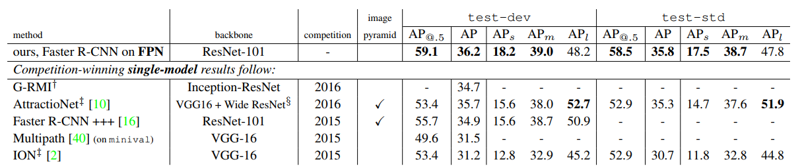

# FPN

## 简介

为了使用更多的语义信息，目标检测模型一般在卷积神经网络最后一层的特征图上进行后续操作（随着不断地下采样，语义信息更丰富，空间信息更稀少），而这一层对应的下采样率一般是比较大的，如16或者32。这就造成原始图像上地小目标在特征图上有效信息较少，小物体检测性能急剧下降，这就是目标检测中的多尺度问题，这个问题很直观，小目标在原图中对应的像素本就不多，下采样后很难找到对应信息。

为了解决多尺度问题，关键在于如何获取多尺度的特征，从数据准备的角度出发有图像金字塔这一策略，它的想法就是将图像调整为多个尺度，不同尺度图像对应不同的特征，这个思路的缺点就是计算量非常之大。不过，它也为后来的一些方法提供了思考，要知道，卷积神经网络层层递进，尺度和语义信息不断变化的过程就是一个金字塔结构，如何能够有效融合不同层卷积生成的特征图，应该可以较好地改善多尺度检测问题，FPN（Feature Pyramid Network）就是以此为出发点诞生的工作，极大地推动了后来目标检测的发展。

- 论文标题

    Feature Pyramid Networks for Object Detection
- 论文地址

    http://arxiv.org/abs/1612.03144
- 论文源码

    https://github.com/jwyang/fpn.pytorch（非官方）

## 网络结构

FPN的结构如下图所示，主要有自下而上、自上而下、横向连接和卷积融合四个操作流程，我们一个个来看。不过，在此之前先对下图做一些必要的说明，图中最左侧的一列表示输入图像经过多个stage的卷积层不断下采样修改特征图的过程，其中C1为最浅几层，空间尺度大语义信息极少，一般不做考虑。


首先，来看最左侧的**自下而上**的操作，这个流是一个普通的ResNet网络，用来提取语义信息，C1至C5代表网络的5个stage（即不同的卷积层），每个stage内部特征图尺寸不变，从C1到C5特征图尺寸递减。由这个卷积网络提取特征的过程，就是自下而上的过程。

接着，我们来看中间那个**自上而下**操作，首先，对最小的特征图进行1x1卷积降维通道得到P5，然后对P5依此进行上采样得到P4、P3和P2，这个步骤是为了保证P4、P3和P2与C4、C3和C2长宽相同，以方便后面的逐元素相加。需要注意的是，这里的上采样实际上是最近邻上采样（临近元素复制），而不是线性插值。

然后，就是所谓的横向连接（Lateral Connection），这个步骤的目的就是将上采样后的高语义特征与下采样之前对应大小的定位细节特征进行融合。不过，上采样的尺寸虽然和浅层特征图一样，但是通道数是不同的，因此为了相加，需要将C2、C3和C4通过1x1卷积调整和P2、P3和P4通道数目一致，均为256。继而逐元素相加得到真正的P2、P3和P4，这个过程就叫做横向连接。

最后就是**卷积融合**的过程，得到相加的P2、P3和P4之后，再通过3x3卷积对这三个特征图进行变换以消除上采样过程带来的重叠效应，生成最终的P2、P3和P4，它们与P5一同输出进行后续任务。

至此，FPN网络结构最核心的部分就讲完了，不过实际目标检测需要在特征图上进行RoI特征提取（通过anchor等），而FPN有四个特征图，因此选用哪个就是值得考虑的。FPPN的方案是，对于不同尺寸的RoI区域，使用不同的特征图，大尺寸RoI需要更加精细的语义信息，即使深层特征图也会有较多信息保留，如在P5上进行；而小尺寸RoI因为尺寸小，高语义信息很难定位，因此采样浅层特征图，如P2。

## 实验

在检测网络中，将neck换为FPN，获得了非常恐怖的效果提升，包括后来的anchor-free的发展，也与FPN的成功是分不开的。



## 代码实现

FPN实现起来不是很难，很多工具箱都做了封装，这里就给出一个比较使用的PyTorch实现版本。

```python
import torch.nn as nn
import torch.nn.functional as F


class Bottleneck(nn.Module):
    expansion = 4

    def __init__(self, in_planes, planes, stride=1, downsample=None):
        super(Bottleneck, self).__init__()
        self.bottleneck = nn.Sequential(
            nn.Conv2d(in_planes, planes, 1, bias=False),
            nn.BatchNorm2d(planes),
            nn.ReLU(inplace=True),
            nn.Conv2d(planes, planes, 3, stride, 1, bias=False),
            nn.BatchNorm2d(planes),
            nn.ReLU(inplace=True),
            nn.Conv2d(planes, self.expansion * planes, 1, bias=False),
            nn.BatchNorm2d(self.expansion * planes),
        )
        self.relu = nn.ReLU(inplace=True)
        self.downsample = downsample

    def forward(self, x):
        identity = x
        out = self.bottleneck(x)
        if self.downsample is not None:
            identity = self.downsample(x)
        out += identity
        out = self.relu(out)
        return out


class FPN(nn.Module):
    def __init__(self, layers):
        super(FPN, self).__init__()
        self.inplanes = 64
        self.conv1 = nn.Conv2d(3, 64, 7, 2, 3, bias=False)
        self.bn1 = nn.BatchNorm2d(64)
        self.relu = nn.ReLU(inplace=True)
        self.maxpool = nn.MaxPool2d(3, 2, 1)

        self.layer1 = self._make_layer(64, layers[0])
        self.layer2 = self._make_layer(128, layers[1], 2)
        self.layer3 = self._make_layer(256, layers[2], 2)
        self.layer4 = self._make_layer(512, layers[3], 2)
        self.toplayer = nn.Conv2d(2048, 256, 1, 1, 0)

        self.smooth1 = nn.Conv2d(256, 256, 3, 1, 1)
        self.smooth2 = nn.Conv2d(256, 256, 3, 1, 1)
        self.smooth3 = nn.Conv2d(256, 256, 3, 1, 1)

        self.latlayer1 = nn.Conv2d(1024, 256, 1, 1, 0)
        self.latlayer2 = nn.Conv2d(512, 256, 1, 1, 0)
        self.latlayer3 = nn.Conv2d(256, 256, 1, 1, 0)

    def _make_layer(self, planes, blocks, stride=1):
        downsample = None
        if stride != 1 or self.inplanes != Bottleneck.expansion * planes:
            downsample = nn.Sequential(
                nn.Conv2d(self.inplanes, Bottleneck.expansion * planes, 1, stride, bias=False),
                nn.BatchNorm2d(Bottleneck.expansion * planes)
            )
        layers = []
        layers.append(Bottleneck(self.inplanes, planes, stride, downsample))
        self.inplanes = planes * Bottleneck.expansion
        for i in range(1, blocks):
            layers.append(Bottleneck(self.inplanes, planes))
        return nn.Sequential(*layers)

    def _upsample_add(self, x, y):
        _, _, H, W = y.shape
        return F.upsample(x, size=(H, W), mode='bilinear') + y

    def forward(self, x):

        c1 = self.maxpool(self.relu(self.bn1(self.conv1(x))))
        c2 = self.layer1(c1)
        c3 = self.layer2(c2)
        c4 = self.layer3(c3)
        c5 = self.layer4(c4)

        p5 = self.toplayer(c5)
        p4 = self._upsample_add(p5, self.latlayer1(c4))
        p3 = self._upsample_add(p4, self.latlayer2(c3))
        p2 = self._upsample_add(p3, self.latlayer3(c2))

        p4 = self.smooth1(p4)
        p3 = self.smooth2(p3)
        p2 = self.smooth3(p2)
        return p2, p3, p4, p5


if __name__ == '__main__':
    fpn = FPN([3, 4, 6, 3])
    print(fpn)
```


## 总结

FPN通过金字塔结构将深层语义信息回传补充浅层语义信息，从而获得了高分辨率、强语义的多层特征，在小目标检测、实例分割领域有着不俗的表现。