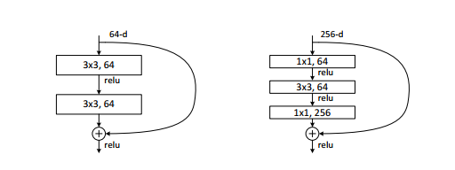

# ResNet
## 简介
CV常见的卷积神经网络中，和曾今的VGG一样，ResNet的提出及其思想对卷积神经网络的发展产生了巨大的影响。由于最近的课题需要回顾常见的里程碑式的CNN结构，以及分析这些结构的划时代意义，所以这里简单介绍一下ResNet。本项目着重实现使用Keras搭建ResNet的网络结构，同时，利用其在数据集上进行效果评测。

- 论文标题

	Deep residual learning for image recognition
- 论文地址

	https://arxiv.org/abs/1512.03385
- 论文源码

	https://github.com/pytorch/vision/blob/master/torchvision/models/resnet.py（PyTorch实现）


## 网络说明

### 设计背景
ResNet(Residual Neural Network，残差神经网络)由Kaiming He（何恺明大神）等人在2015年的提出。他们通过特殊的网络结构设计，训练出了一个152层的深度神经网络，并在ImageNet比赛分类任务上获得了冠军(top-5错误率3.57\%)。
ResNet的提出第一次有事实地打破了**深度网络无法训练**的难题，其模型的不仅在多个数据集上准确率得到提高，而且参数量还比VGG少（**其实纵观卷积神经网络这几年的发展都是网络越来越深、越来越轻量**）。
自此之后，很多神经网络的设计都借鉴了ResNet的思想，如Google InceptionV4，DenseNet等，其思想使得卷积模型的性能进一步提高。

### 设计思路

**以往问题**

- 实验结果表明，层数的增加会提高网络的学习效果（理想情况下），但是，单纯增加网络深度，神经网络的学习会变得十分困难，因此反而不能得到预期效果。（论文中提出，这个原理很容易理解，随着深度增加，以链式法则为基础的反向传播会出现难以传播的问题，这引出很多著名的训练问题，如梯度消失。）
- 通常认为神经网络的深度对其性能影响较大，越深的网络往往能得到更好的性能（网络越深效果越好是不合理的观念），但是随着网络的加深，容易出现Degradation问题，即准确率上升然后饱和继而下降的现象，导致训练困难，这个问题通常叫做**梯度退化（gradient degradation）**。注意，**这并非常见的过拟合（overfit）问题，因为无论训练集还是验证集loss都会加大。**


**解决方法**

- 为了解决上述的问题，ResNet提出了一种残差模块（residual block）用于解决这个问题。既然网络加深到一定的程度会出现准确率饱和和准确率下降问题，那么，不妨在特征传递的过程中，让后续网络层的传递媒介影响降低，使用全等映射将输入直接传递给输出，保证网络的性能至少不会下降。


在上面的残差模块中，提供了两条道路，一条是经过residual映射得到$F(x)$，其计算式可以理解为$F(x)=r e l u\left(w_{2} *\left(r e l u\left(w_{1} * x\right)\right)\right)$，另一条则是直接传递$x$本身。将这两个结果合并之后激活传入下一个模块，即输出$H(x)=F(x)+x$（**这个操作没有加大网络运算的复杂度，并且常用的深度学习框架很容易执行**）。当网络训练已经达到最优，网络的后续训练将会限制residual网络的映射，当residual被限制为0时，就只剩下全等映射的x，网络也不会因为深度的加深造成准确率下降了。（这样，通过限制，下一个模块得到的就是本模块的输入$x$，缓解深度难以传递的状况。）

**ResNet的核心**，拟合残差函数$F=H(x)-g(x)=H(x)-x$（选择$g(x)=x$是因为此时的$g(x)$效果最好）。其中$x$是由全等映射传递过去的，而$F(x)$是由residual映射传递的，网络的训练将对$F(x)$部分residual网络的权重进行优化更新，学习的目标不再是完整的输出$H(x)$,而变成了输出与输入的差别$H(x)-x$，$F(x)$也就是**残差**。

在整个ResNet中广泛使用这种残差模块，该模块使用了两个**分支**的方法，其中一个分支直接将输入传递到下一层，使得原始信息的更多的保留，解决了深度网络信息丢失和信息损耗的问题，这种结构被称之为shortcut或者skip connections。

由于使用了shortcut，原来需要学习逼近的恒等映射$H(x)$变成逼近$F(x) = H(x) - x$这个函数。论文作者认为这两种表达的效果是一致的，但是优化的难度却不同,$F(x)$的优化比$H(x)$的优化简单很多（该想法源于图像处理中的残差向量编码）。


## 残差网络

### shortcuts

在之前的图片上，恒等映射$x$使用的为identity shortcuts（同维度元素级相加）；事实上，论文还研究了一种project shortcuts（$y=F(x,{W_i})+W_sx$），主要包含以下三种情况，且通过实验效果是逐渐变好的。
- 维度无变化则直接相连，维度增加的连接通过补零填充后再连接。shortcuts是恒等的，这个连接并不会带来新的参数。
- 维度无变化则直接相连，维度增加的连接通过投影连接，投影连接会增加参数。
- 所有连接均采用投影连接。

### bottleneck
)

当研究50层以上的深层网络时，使用了上图右边所示的Bottleneck网络结构，该结构第一层使用1\*1的卷积层来降维，最后一层使用1\*1的卷积层来进行升维，从而保持与原来输入同维以便于恒等映射。


## 网络结构

**网络结构图**


常见的ResNet为50层的**ResNet50**以及ResNet101和当年比赛使用的ResNet152。 结构上，先通过一个普通的(7,7)卷积层对输入图片进行特征提取同时因为步长为2尺寸减半；随即，通过(3,3)最大池化层进一步缩小feature map的尺寸；随后，送入各个残差模块（论文中命名为conv2_x的网络为一个block，同一个block有多个残差模块连接）。最后，将特征图送入全局池化层进行规整，再使用softmax激活进行分类，得到概率分布向量。（这里fc层输出1000类是因为ImageNet有1000个类别）

虽然，ResNet比起VGG19这样的网络深很多，但是运算量是远少于VGG19等VGGNet的。

**网络对比**


左侧为经典VGG19结构图，中间为类VGG19的34层普通网络图，右侧为带恒等映射的34层ResNet网络图。其中，黑色实线代表同一维度下（卷积核数目相同）的恒等映射，虚线代表不同维度下（卷积核数目不同）的恒等映射。

**训练效果**


左侧为普通网络，右侧为残差网络，粗线代表训练损失，细线代表验证损失。显然，普通网络34层训练损失和验证损失均大于18层，残差网络不存在这个现象，这说明残差网络确实有效解决了梯度退化问题（这也是ResNet的初衷）。


## 代码实现

实际使用各个深度学习框架已经封装了ResNet的几种主要网络结构，使用很方便，不建议自己搭建（尤其对于ResNet152这样很深的网络）。

下面使用Keras构建ResNet34和ResNet50，前者使用identity block作为残差模块，后者使用bottleneck block作为残差模块，同时为了防止过拟合且输出高斯分布，自定义了紧跟BN层的卷积层Conv2D_BN。

 **网络构建对照结构表及结构说明即可，这是复现论文网络结构的主要依据。**

 ```python
def Conv2D_BN(x, filters, kernel_size, strides=(1, 1), padding='same', name=None):
    if name:
        bn_name = name + '_bn'
        conv_name = name + '_conv'
    else:
        bn_name = None
        conv_name = None
    x = Conv2D(filters, kernel_size, strides=strides, padding=padding, activation='relu', name=conv_name)(x)
    x = BatchNormalization(name=bn_name)(x)
    return x


def identity_block(input_tensor, filters, kernel_size, strides=(1, 1), is_conv_shortcuts=False):
    """

    :param input_tensor:
    :param filters:
    :param kernel_size:
    :param strides:
    :param is_conv_shortcuts: 直接连接或者投影连接
    :return:
    """
    x = Conv2D_BN(input_tensor, filters, kernel_size, strides=strides, padding='same')
    x = Conv2D_BN(x, filters, kernel_size, padding='same')
    if is_conv_shortcuts:
        shortcut = Conv2D_BN(input_tensor, filters, kernel_size, strides=strides, padding='same')
        x = add([x, shortcut])
    else:
        x = add([x, input_tensor])
    return x


def bottleneck_block(input_tensor, filters=(64, 64, 256), strides=(1, 1), is_conv_shortcuts=False):
    """

    :param input_tensor:
    :param filters:
    :param strides:
    :param is_conv_shortcuts: 直接连接或者投影连接
    :return:
    """
    filters_1, filters_2, filters_3 = filters
    x = Conv2D_BN(input_tensor, filters=filters_1, kernel_size=(1, 1), strides=strides, padding='same')
    x = Conv2D_BN(x, filters=filters_2, kernel_size=(3, 3))
    x = Conv2D_BN(x, filters=filters_3, kernel_size=(1, 1))
    if is_conv_shortcuts:
        short_cut = Conv2D_BN(input_tensor, filters=filters_3, kernel_size=(1, 1), strides=strides)
        x = add([x, short_cut])
    else:
        x = add([x, input_tensor])
    return x


def ResNet34(input_shape=(224, 224, 3), n_classes=1000):
    """

    :param input_shape:
    :param n_classes:
    :return:
    """

    input_layer = Input(shape=input_shape)
    x = ZeroPadding2D((3, 3))(input_layer)
    # block1
    x = Conv2D_BN(x, filters=64, kernel_size=(7, 7), strides=(2, 2), padding='valid')
    x = MaxPooling2D(pool_size=(3, 3), strides=2, padding='same')(x)
    # block2
    x = identity_block(x, filters=64, kernel_size=(3, 3))
    x = identity_block(x, filters=64, kernel_size=(3, 3))
    x = identity_block(x, filters=64, kernel_size=(3, 3))
    # block3
    x = identity_block(x, filters=128, kernel_size=(3, 3), strides=(2, 2), is_conv_shortcuts=True)
    x = identity_block(x, filters=128, kernel_size=(3, 3))
    x = identity_block(x, filters=128, kernel_size=(3, 3))
    x = identity_block(x, filters=128, kernel_size=(3, 3))
    # block4
    x = identity_block(x, filters=256, kernel_size=(3, 3), strides=(2, 2), is_conv_shortcuts=True)
    x = identity_block(x, filters=256, kernel_size=(3, 3))
    x = identity_block(x, filters=256, kernel_size=(3, 3))
    x = identity_block(x, filters=256, kernel_size=(3, 3))
    x = identity_block(x, filters=256, kernel_size=(3, 3))
    x = identity_block(x, filters=256, kernel_size=(3, 3))
    # block5
    x = identity_block(x, filters=512, kernel_size=(3, 3), strides=(2, 2), is_conv_shortcuts=True)
    x = identity_block(x, filters=512, kernel_size=(3, 3))
    x = identity_block(x, filters=512, kernel_size=(3, 3))
    x = AveragePooling2D(pool_size=(7, 7))(x)
    x = Flatten()(x)
    x = Dense(n_classes, activation='softmax')(x)

    model = Model(inputs=input_layer, outputs=x)
    return model


def ResNet50(input_shape=(224, 224, 3), n_classes=1000):
    """

    :param input_shape:
    :param n_classes:
    :return:
    """
    input_layer = Input(shape=input_shape)
    x = ZeroPadding2D((3, 3))(input_layer)
    # block1
    x = Conv2D_BN(x, filters=64, kernel_size=(7, 7), strides=(2, 2), padding='valid')
    x = MaxPooling2D(pool_size=(3, 3), strides=(2, 2), padding='same')(x)

    # block2
    x = bottleneck_block(x, filters=(64, 64, 256), strides=(1, 1), is_conv_shortcuts=True)
    x = bottleneck_block(x, filters=(64, 64, 256))
    x = bottleneck_block(x, filters=(64, 64, 256))
    # block3
    x = bottleneck_block(x, filters=(128, 128, 512), strides=(2, 2), is_conv_shortcuts=True)
    x = bottleneck_block(x, filters=(128, 128, 512))
    x = bottleneck_block(x, filters=(128, 128, 512))
    x = bottleneck_block(x, filters=(128, 128, 512))
    # block4
    x = bottleneck_block(x, filters=(256, 256, 1024), strides=(2, 2), is_conv_shortcuts=True)
    x = bottleneck_block(x, filters=(256, 256, 1024))
    x = bottleneck_block(x, filters=(256, 256, 1024))
    x = bottleneck_block(x, filters=(256, 256, 1024))
    x = bottleneck_block(x, filters=(256, 256, 1024))
    x = bottleneck_block(x, filters=(256, 256, 1024))
    # block5
    x = bottleneck_block(x, filters=(512, 512, 2048), strides=(2, 2), is_conv_shortcuts=True)
    x = bottleneck_block(x, filters=(512, 512, 2048))
    x = bottleneck_block(x, filters=(512, 512, 2048))
    x = AveragePooling2D(pool_size=(7, 7))(x)
    x = Flatten()(x)
    x = Dense(n_classes, activation='softmax')(x)

    model = Model(inputs=input_layer, outputs=x)
    return model

```

数据集使用[Caltech101数据集](http://www.vision.caltech.edu/Image_Datasets/Caltech101/)，比较性能，不进行数据增广（注意删除干扰项）。Batch大小指定为32，使用BN训练技巧，二次封装Conv2D。 损失函数使用经典分类的交叉熵损失函数，优化函数使用Adam，激活函数使用Relu。（这都是比较流行的选择）

具体结果见文末Github仓库根目录notebook文件。


比较于我之前介绍的[VGGNet](https://blog.csdn.net/zhouchen1998/article/details/92700960)，显然，同一个数据集上ResNet训练速度快了很多，在同样轮次的训练下，验证集到达的准确率比VGGNet高很多，这正是验证了**比起VGGNet，ResNet计算量更少（表现为训练速度快），同样ResNet网络模型效果好（表现为验证集准确率高）。**

## 补充说明

ResNet最核心的就是利用residual block通过转换映射目标从而解决梯度退化问题，这才是ResNet的核心，至于具体的网络结构，不同的场景可能需求的结构不同，应当明白的是其精髓。