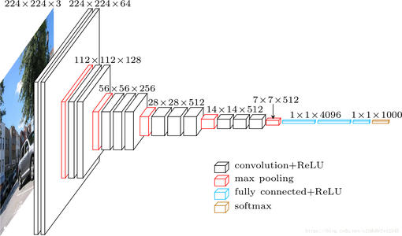
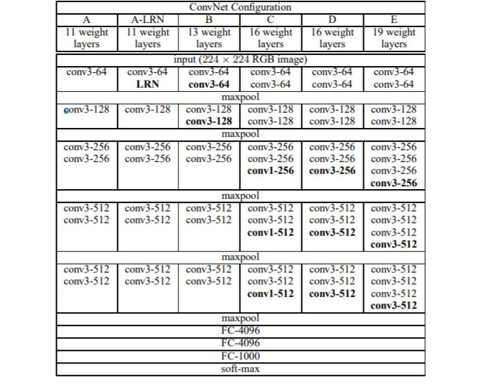

# VGGNet
## 简介
 纵观如今DeepLearning的研究领域，主要的研究领域还是CV和NLP及其衍生领域。CV的常见神经网络中，VGGNet在卷积神经网络的发展过程有着举足轻重的作用，它作为着LeNet与Resnet的承接者，直到今天类VGG结构仍在图像领域发挥着巨大的作用。由于最近的课题设计到VGGNet和Resnet的研究，在本项目着重实现每一个版本的VGGNet兼以近年的优化方式优化VGGNet。

- 论文标题

	Very deep convolutional networks for large-scale image recognition
- 论文地址

	https://arxiv.org/abs/1409.1556
- 论文源码

	https://github.com/pytorch/vision/blob/master/torchvision/models/vgg.py（PyTorch实现）

## 网络说明

### 设计背景
VGGNet的基本模型主要由牛津大学的几何视觉组（Visual Geometry Group）于2014年提出，这也是网络名称的由来，其获得了2014年ILSVRC竞赛的分类任务的第二名和定位任务的第一名，其最伟大之处在于证明使用3*3的小卷积核通过多层堆叠可以有效提高模型性能及泛化能力，这也是后面较长时间CNN倾向于小卷积核的原因之一。

### 结构说明





如图所示，共有6种网络配置，其实按照层数来说只有11层、13层、16层、19层四种，主要区别在于11层网络尝试了使用Local Response Normalisation（LRN），结果并没有提高网络性能，另一个区别就是16层（这就是著名的VGG16）结构在最后三个block使用不同的卷积核大小。网络上可以找到很多概念结构图，上面列举了一个很经典的。

### 主要贡献

**使用3\*3的小卷积核堆叠。**

为什么使用3\*3的小卷积核？这主要基于两个考虑，不过解释之前必须明确一个概念，两个3\*3卷积核可以获得一个5\*5的卷积核视野，三个3\*3的卷积核堆叠可以获得7\*7的感受野。（注意，之间不能有池化层）
- 第一，三次卷积会进行三次非线性变换。这种非线性变换会有效提高不同信息的判别能力（即对差异的识别能力）。
- 第二，利用三个3\*3代替一个7*7可以减少参数数量。（过多的参数是神经网络的通有的问题）假设对于3通道，三个3\*3卷积核的参数量为$3\times (3^2C^2)=27C^2$，而一个7\*7卷积核参数量为$7^2C^2=49C^2$。

**真正提高了网络的深度。**
- 更深的模型的好处就是可以进行更多的非线性映射次数，从而提高网络的信息判别能力。这样做的前提是参数量不会增加太多，这是基于小卷积核做到的。
- 使用1\*1小卷积核也是为了增加非线性变换次数。

## 代码实现

由于代码过多，只列举VGG16和VGG19的实现代码，其余见文末Github。

```python
def VGG16D(input_shape=(224, 224, 3), n_classes=1000):
	"""
	实现VGG16D的网络结构（著名的VGG16）
	没有使用Dropout和BN
	:param input_shape:
	:param n_classes:
	:return:
	"""
	# input layer
	input_layer = Input(shape=input_shape)
	# block1
	x = Conv2D(filters=64, kernel_size=(3, 3), strides=(1, 1), padding='same', activation='relu')(input_layer)
	x = Conv2D(64, (3, 3), strides=1, padding='same', activation='relu')(x)
	x = MaxPooling2D(2, 2, padding='same')(x)
	# block2
	x = Conv2D(128, (3, 3), strides=1, padding='same', activation='relu')(x)
	x = Conv2D(128, (3, 3), strides=1, padding='same', activation='relu')(x)
	x = MaxPooling2D(2, 2, padding='same')(x)
	# block3
	x = Conv2D(256, (3, 3), strides=1, padding='same', activation='relu')(x)
	x = Conv2D(256, (3, 3), strides=1, padding='same', activation='relu')(x)
	x = Conv2D(256, (3, 3), strides=1, padding='same', activation='relu')(x)
	x = MaxPooling2D(2, 2, padding='same')(x)
	# block4
	x = Conv2D(512, (3, 3), strides=1, padding='same', activation='relu')(x)
	x = Conv2D(512, (3, 3), strides=1, padding='same', activation='relu')(x)
	x = Conv2D(512, (3, 3), strides=1, padding='same', activation='relu')(x)
	x = MaxPooling2D(2, 2, padding='same')(x)
	x = BatchNormalization()(x)
	# block5
	x = Conv2D(512, (3, 3), strides=1, padding='same', activation='relu')(x)
	x = Conv2D(512, (3, 3), strides=1, padding='same', activation='relu')(x)
	x = Conv2D(512, (3, 3), strides=1, padding='same', activation='relu')(x)
	x = MaxPooling2D(2, 2, padding='same')(x)
	x = BatchNormalization()(x)
	# fc
	x = Flatten()(x)
	x = Dense(4096, activation='relu')(x)
	x = Dropout(rate=0.5)(x)
	x = Dense(4096, activation='relu')(x)
	x = Dropout(rate=0.5)(x)
	output_layer = Dense(n_classes, activation='softmax')(x)

	model = Model(inputs=input_layer, outputs=output_layer)
	return model


def VGG19(input_shape=(224, 224, 3), n_classes=1000):
	"""
	实现VGG16C的网络结构（著名的VGG16）
	没有使用Dropout和BN
	:param input_shape:
	:param n_classes:
	:return:
	"""
	# input layer
	input_layer = Input(shape=input_shape)
	# block1
	x = Conv2D(filters=64, kernel_size=(3, 3), strides=(1, 1), padding='same', activation='relu')(input_layer)
	x = Conv2D(64, (3, 3), strides=1, padding='same', activation='relu')(x)
	x = MaxPooling2D(2, 2, padding='same')(x)
	# block2
	x = Conv2D(128, (3, 3), strides=1, padding='same', activation='relu')(x)
	x = Conv2D(128, (3, 3), strides=1, padding='same', activation='relu')(x)
	x = MaxPooling2D(2, 2, padding='same')(x)
	# block3
	x = Conv2D(256, (3, 3), strides=1, padding='same', activation='relu')(x)
	x = Conv2D(256, (3, 3), strides=1, padding='same', activation='relu')(x)
	x = Conv2D(256, (3, 3), strides=1, padding='same', activation='relu')(x)
	x = Conv2D(256, (3, 3), strides=1, padding='same', activation='relu')(x)
	x = MaxPooling2D(2, 2, padding='same')(x)
	# block4
	x = Conv2D(512, (3, 3), strides=1, padding='same', activation='relu')(x)
	x = Conv2D(512, (3, 3), strides=1, padding='same', activation='relu')(x)
	x = Conv2D(512, (3, 3), strides=1, padding='same', activation='relu')(x)
	x = Conv2D(512, (3, 3), strides=1, padding='same', activation='relu')(x)
	x = MaxPooling2D(2, 2, padding='same')(x)
	x = BatchNormalization()(x)
	# block5
	x = Conv2D(512, (3, 3), strides=1, padding='same', activation='relu')(x)
	x = Conv2D(512, (3, 3), strides=1, padding='same', activation='relu')(x)
	x = Conv2D(512, (3, 3), strides=1, padding='same', activation='relu')(x)
	x = Conv2D(512, (3, 3), strides=1, padding='same', activation='relu')(x)
	x = MaxPooling2D(2, 2, padding='same')(x)
	x = BatchNormalization()(x)
	# fc
	x = Flatten()(x)
	x = Dense(4096, activation='relu')(x)
	x = Dropout(rate=0.5)(x)
	x = Dense(4096, activation='relu')(x)
	x = Dropout(rate=0.5)(x)
	output_layer = Dense(n_classes, activation='softmax')(x)

	model = Model(inputs=input_layer, outputs=output_layer)
	return model
```
为了编写效率，均使用Function API。（事实上Keras的构建精髓正是Function API）

模型的训练及测试均在[Caltech101数据集](http://www.vision.caltech.edu/Image_Datasets/Caltech101/)上进行（该数据集由李飞飞整理，含一个干扰项）。为了比较模型性能，不进行数据增广，采用同样的优化函数Adam。模型训练选取适中batch_size，为128，使用了BN和Dropout等训练技巧（这不影响核心网络结构）。后面的深层模型如VGG16和VGG19不使用Dropout或者BN难以训练，每个block输出时使用BN层。

**训练结果**

损失图像


从上图可以看出，随着模型深度加深，训练集上损失收敛速度变慢，验证集上损失收敛波动大。

准确率图像


从上图可以看出，随着模型深度加深，训练集上准确率上升变慢，在同样的epoch下，到达的最终验证集准确率变低。

整体看来，随着模型加深，需要更多的训练控制如Dropout和BN这样的中间层来提高训练效果。

**关键提示**

当使用VGGNet时一般使用的并非上述任何一种网络模型，每个block的卷积层数目、是否使用Dropout、是否使用BN等完全依据当前任务修改即可。VGG最伟大之处绝对不是这个VGG模型而是小卷积核多层叠加的思想，这也是后来的卷积网络的大部分采用的思路。


## 补充说明
本项目实现基于Keras2(TensorFlow后端)以及Python3。如有疏漏，欢迎评论指出。